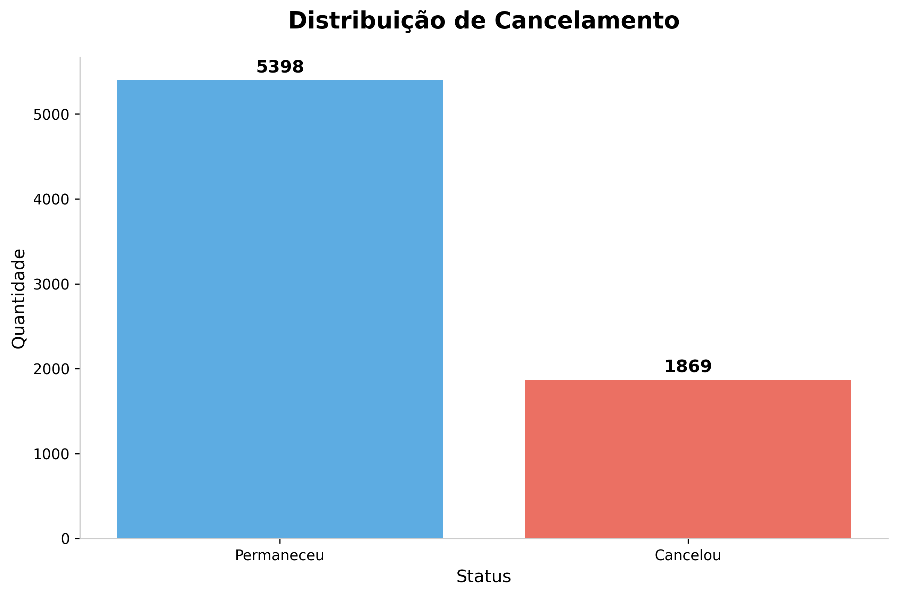

# 📊 Telecom X – Análise de Cancelamento de Clientes

Este repositório contém um projeto prático de análise de dados voltado para compreender as causas do **alto índice de cancelamento** de clientes da empresa fictícia **Telecom X**, uma operadora de telecomunicações.

---

## 🎯 Objetivo
O principal desafio foi aplicar conceitos de **ETL** (Extração, Transformação e Carga) e **EDA** (Análise Exploratória de Dados) para identificar padrões e características que influenciam a saída dos clientes, ajudando na criação de estratégias para **aumentar a retenção**.

---

## 🛠️ Etapas do Projeto

### 1️⃣ Extração
- 📥 Dados obtidos via API simulada, disponibilizada no GitHub, em formato CSV.

### 2️⃣ Transformação
- 🧹 Limpeza e tratamento dos dados.
- 🔄 Conversão de tipos e padronização de variáveis.
- 🚫 Tratamento de valores ausentes e duplicados.
- ➕ Criação de novas variáveis, como **Contas_Diarias** para estimar faturamento diário.

### 3️⃣ Análise
- 📊 Utilização de **Python, Pandas, NumPy, Seaborn, Matplotlib e Plotly** para gerar visualizações e insights.
- 📉 Avaliação do impacto de variáveis categóricas e numéricas na taxa de cancelamento.

---

## 🔍 Principais Análises Realizadas
-  Distribuição de cancelamento entre clientes ativos e cancelados.
-  Comparação do cancelamento por tipo de contrato.
-  Impacto do tempo de serviço (**tenure**) no cancelamento.
-  Relação entre cancelamento e serviços contratados (internet, telefone, segurança online).
- Análise por forma de pagamento e perfil demográfico.

---

## 💡 Principais Insights
-  **Contratos mensais** apresentam a maior taxa de cancelamento.
-  A maioria dos cancelamentos ocorre nos **primeiros 12 meses** de serviço.
-  Clientes com serviços como **segurança online** e **suporte técnico** tendem a permanecer mais tempo.
- **Métodos de pagamento automáticos** estão associados a menor taxa de cancelamento.
---
## 🖼️ Principais Visualizações

  

---
## 🖥️ Tecnologias Utilizadas

---

## 📂 Arquivos do Projeto
- **[📓 Notebook da Análise](https://drive.google.com/file/d/1Wt9d-KCF9bkSe67l_z40T62rbgK0H91O/view?usp=sharing)** → contém todo o processo de ETL, análise exploratória e geração de gráficos.
- **`dados/`** → pasta com a base de dados utilizada.
- **`imagens/`** → visualizações geradas durante a análise.

---

## 📚 Sobre o Projeto
Este trabalho foi desenvolvido como parte de um estudo prático de análise de dados, com foco em **ETL, análise exploratória e geração de relatórios** para tomada de decisão.

---

##  Autor
**Nome:** Weverton Farias  

